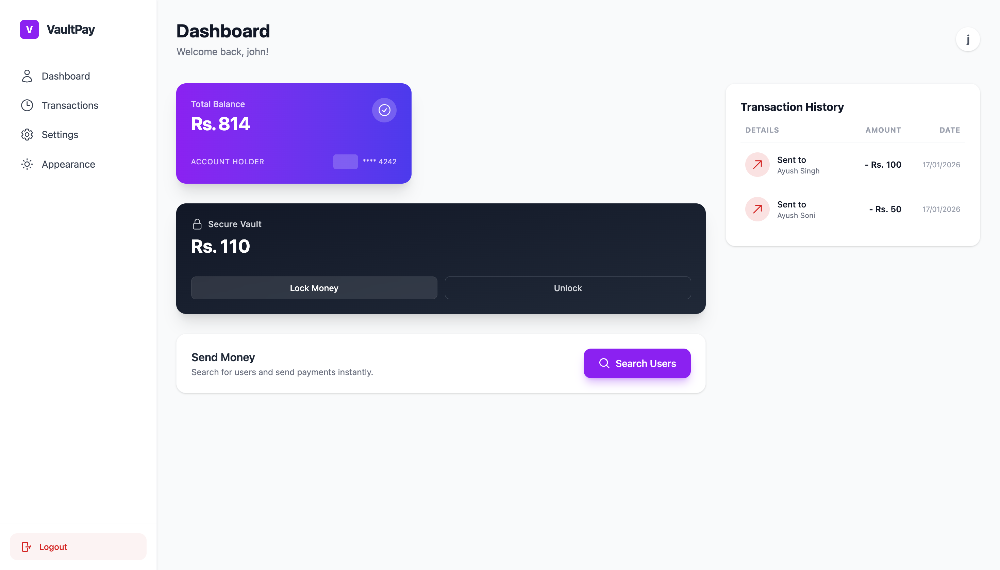
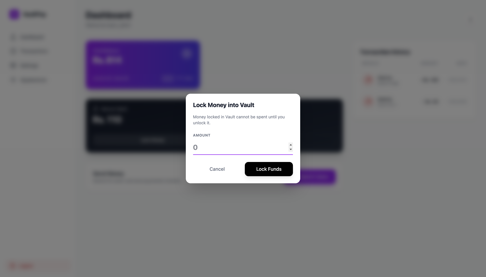
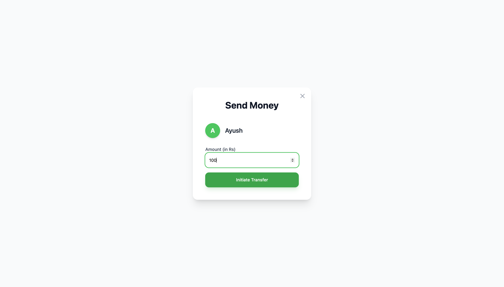
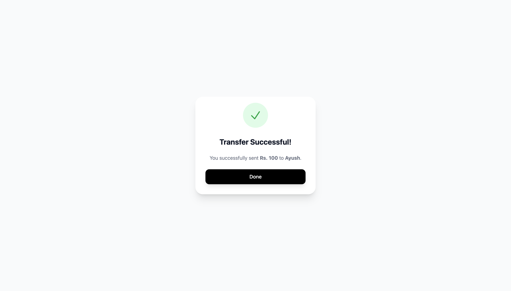
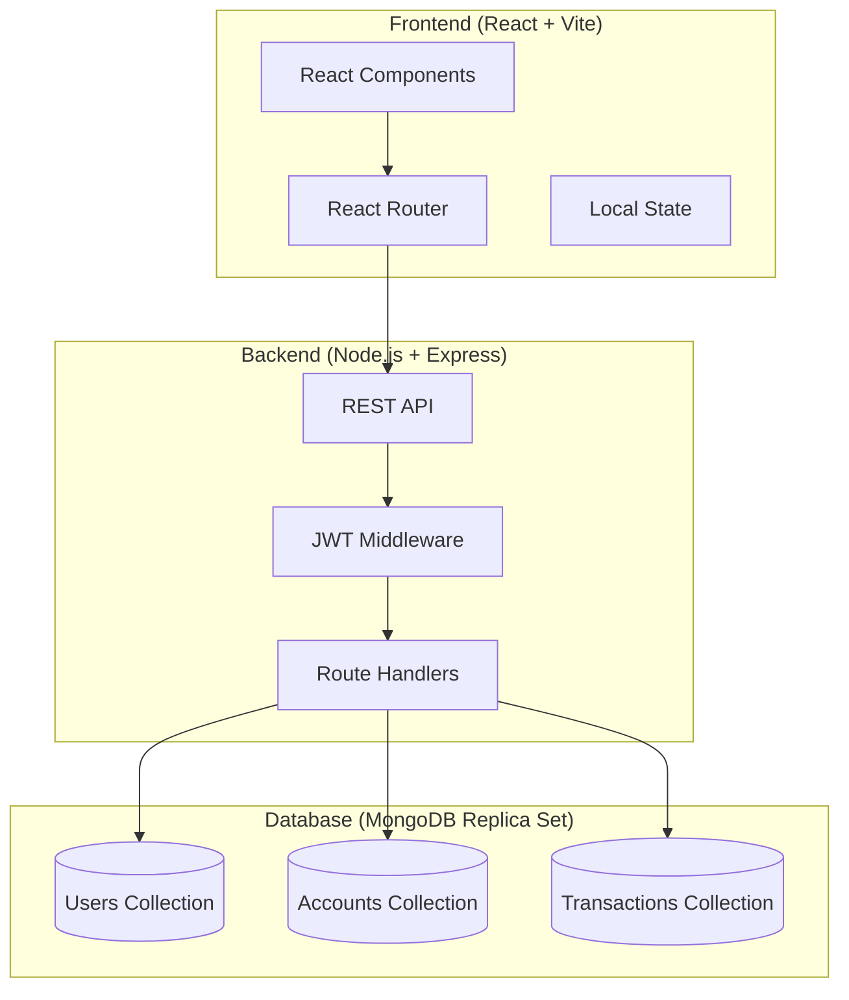

<div align="center">

# 🏦 VaultPay

### Modern Peer-to-Peer Payment Platform

[](https://nodejs.org/)
[](https://reactjs.org/)
[](https://www.mongodb.com/)
[](LICENSE)

**Fast, secure, and user-friendly digital payments with ACID-compliant transactions**

[Features](#-features) • [Architecture](#-architecture) • [Quick Start](#-quick-start) • [API Reference](#-api-reference) • [Screenshots](#-screenshots)

</div>

---

## 📋 Overview

VaultPay is a full-stack digital payment platform that enables seamless peer-to-peer money transfers. Built with a modern React frontend and a robust Node.js/Express backend, the application leverages MongoDB replica sets to ensure **ACID-compliant transactions** for financial operations.

The platform features a unique **Vault** system that allows users to securely save money in a separate balance, providing an intuitive way to manage funds.

---

## ✨ Features

### 💳 Core Payments
- **Instant P2P Transfers** — Send money to any registered user with atomic, ACID-compliant transactions
- **Real-time Balance** — View your current balance instantly
- **Transaction History** — Complete audit trail of all sent and received payments

### 🔐 Security
- **JWT Authentication** — Secure token-based authentication with HttpOnly cookies
- **Password Hashing** — Industry-standard bcrypt encryption
- **Input Validation** — Comprehensive request validation using Zod schemas
- **Session Transactions** — MongoDB sessions ensure data integrity during transfers

### 💰 Vault System
- **Secure Savings** — Deposit funds into a separate vault balance
- **Easy Withdrawals** — Move money back to main balance when needed
- **Atomic Operations** — All vault operations are transaction-safe

### 👥 User Management
- **User Registration** — Simple signup with email verification
- **Profile Updates** — Modify name and password securely
- **User Search** — Find other users by name for easy transfers
- **Recent Contacts** — Quick access to frequently contacted users

---

## 📸 Screenshots

<div align="center">

<!-- | Landing Page | Dashboard | -->
|:---:|:---:|
|  |  |

<!-- | Send Money | Transaction History | -->
|:---:|:---:|
|  |  |

</div>

---

## 🏗 Architecture



### Tech Stack

| Layer | Technologies |
|-------|-------------|
| **Frontend** | React 18, Vite, React Router, Tailwind CSS, Axios |
| **Backend** | Node.js, Express.js, Mongoose, Zod, JWT, bcrypt |
| **Database** | MongoDB (Replica Set for ACID transactions) |
| **Testing** | Jest, Supertest, Vitest, Testing Library |

### Project Structure

```
VaultPay/
├── backend/                    # Express.js API Server
│   ├── route/
│   │   ├── user.js            # Authentication & user endpoints
│   │   └── account.js         # Balance & transfer endpoints
│   ├── __tests__/             # API integration tests
│   ├── db.js                  # Mongoose schemas & models
│   ├── middleware.js          # JWT authentication middleware
│   ├── config.js              # Application configuration
│   └── index.js               # Server entry point
│
├── frontend/                   # React SPA
│   ├── src/
│   │   ├── Pages/             # Route components
│   │   │   ├── Landing.jsx    # Marketing landing page
│   │   │   ├── Dashboard.jsx  # Main user dashboard
│   │   │   ├── SendMoney.jsx  # Transfer interface
│   │   │   ├── Signin.jsx     # Login page
│   │   │   └── Signup.jsx     # Registration page
│   │   └── components/        # Reusable UI components
│   │       ├── Balance.jsx    # Balance display card
│   │       ├── VaultCard.jsx  # Vault management UI
│   │       ├── History.jsx    # Transaction history
│   │       ├── Users.jsx      # User search & list
│   │       └── ...
│   └── public/                # Static assets
│
└── Dockerfile                 # MongoDB replica set configuration
```

### Data Models

```javascript
// User Schema
{
  email: String,      // Unique email address
  password: String,   // bcrypt hashed password
  firstName: String,
  lastName: String
}

// Account Schema
{
  userId: ObjectId,    // Reference to User
  balance: Number,     // Available balance
  vaultBalance: Number // Saved funds in vault
}

// Transaction Schema
{
  senderId: ObjectId,   // Sender user reference
  receiverId: ObjectId, // Receiver user reference
  amount: Number,
  timestamp: Date
}
```

---

## 🚀 Quick Start

### Prerequisites

- **Node.js** 18 or higher
- **npm** or **pnpm**
- **Docker** (recommended for MongoDB replica set)

### 1. Clone & Install

```bash
# Clone the repository
git clone https://github.com/yourusername/VaultPay.git
cd VaultPay

# Install backend dependencies
cd backend && npm install

# Install frontend dependencies
cd ../frontend && npm install
```

### 2. Configure Environment Variables

Create `backend/.env`:

```env
MONGO_URL=mongodb://localhost:27017/vaultpay?replicaSet=rs
NODE_ENV=development
PORT=3000
```

> ⚠️ **Important**: Update `backend/config.js` to use environment variables for `JWT_SECRET` in production.

### 3. Start MongoDB Replica Set

**Option A — Using the provided Dockerfile:**

```bash
docker build -t mongo-rs -f Dockerfile .
docker run -d --name vaultpay-mongo -p 27017:27017 mongo-rs
```

**Option B — Manual initialization:**

```bash
docker run -d --name vaultpay-mongo -p 27017:27017 mongo:4.4.7 --replSet rs
docker exec -it vaultpay-mongo mongosh --eval "rs.initiate()"
```

**Verify replica set status:**

```bash
docker exec -it vaultpay-mongo mongosh --eval "rs.status()"
```

### 4. Run the Application

```bash
# Terminal 1: Start Backend
cd backend
node index.js
# Server runs at http://localhost:3000

# Terminal 2: Start Frontend
cd frontend
npm run dev
# App runs at http://localhost:5173
```

---

## 📡 API Reference

**Base URL:** `http://localhost:3000/api/v1`

### Authentication

All protected endpoints require authentication via:
- **HttpOnly Cookie**: Automatically set on login
- **Bearer Token**: `Authorization: Bearer <token>`

---

### User Endpoints

| Method | Endpoint | Auth | Description |
|--------|----------|------|-------------|
| `POST` | `/user/signup` | ❌ | Create new account |
| `POST` | `/user/signin` | ❌ | Login and receive token |
| `POST` | `/user/logout` | ❌ | Clear authentication cookie |
| `PUT` | `/user/` | ✅ | Update profile (name, password) |
| `GET` | `/user/me` | ✅ | Get current user info |
| `GET` | `/user/bulk?filter=` | ✅ | Search users by name |

#### Signup Request

```json
POST /user/signup
{
  "email": "user@example.com",
  "password": "SecurePass123",
  "firstName": "John",
  "lastName": "Doe"
}
```

#### Signin Response

```json
{
  "message": "Signin succeeded",
  "token": "eyJhbGciOiJIUzI1NiIs...",
  "user": {
    "id": "507f1f77bcf86cd799439011",
    "email": "user@example.com",
    "firstName": "John",
    "lastName": "Doe"
  }
}
```

---

### Account Endpoints

| Method | Endpoint | Auth | Description |
|--------|----------|------|-------------|
| `GET` | `/account/balance` | ✅ | Get current balance and vault balance |
| `POST` | `/account/transfer` | ✅ | Transfer money to another user |
| `POST` | `/account/vault/deposit` | ✅ | Move funds to vault |
| `POST` | `/account/vault/withdraw` | ✅ | Withdraw from vault |
| `GET` | `/account/history` | ✅ | Get transaction history |

#### Transfer Request

```json
POST /account/transfer
{
  "to": "507f1f77bcf86cd799439012",
  "amount": 100
}
```

#### Balance Response

```json
{
  "balance": 5000,
  "vaultBalance": 2000
}
```

---

## 🧪 Testing

### Backend Tests

```bash
cd backend

# Run tests in watch mode
npm test

# Run with coverage
npm run test:coverage

# CI mode
npm run test:ci
```

### Frontend Tests

```bash
cd frontend

# Run tests
npm test

# Watch mode
npm run test:watch

# With UI
npm run test:ui

# Coverage report
npm run test:coverage
```

---

## 🔧 Development

### Available Scripts

#### Frontend (`frontend/`)

| Script | Description |
|--------|-------------|
| `npm run dev` | Start Vite development server |
| `npm run build` | Build for production |
| `npm run preview` | Preview production build |
| `npm run lint` | Run ESLint |

#### Backend (`backend/`)

| Script | Description |
|--------|-------------|
| `node index.js` | Start the server |
| `npm test` | Run Jest tests |

### Troubleshooting

<details>
<summary><strong>Transaction Error: "Transaction numbers are only allowed on a replica set member"</strong></summary>

Ensure MongoDB is running as a replica set and your `MONGO_URL` includes `?replicaSet=rs`.

```bash
# Verify replica set status
docker exec -it vaultpay-mongo mongosh --eval "rs.status()"
```

</details>

<details>
<summary><strong>Cookies not being set in browser</strong></summary>

- Ensure frontend and backend are on compatible origins
- Verify CORS credentials are configured
- Check that `sameSite` and `secure` cookie options are appropriate for your environment

</details>

---

## 🚢 Production Deployment

### Environment Setup

```env
# Required production environment variables
MONGO_URL=mongodb+srv://...  # Use managed MongoDB Atlas or replica set
JWT_SECRET=your-secure-secret
NODE_ENV=production
PORT=3000
```

### Deployment Checklist

- [ ] Set `NODE_ENV=production` for secure cookies
- [ ] Use environment variables for all secrets (never hardcode)
- [ ] Deploy frontend to CDN/static host (Vercel, Netlify)
- [ ] Run backend behind reverse proxy with HTTPS (Nginx)
- [ ] Use managed MongoDB replica set (Atlas) or configure HA cluster
- [ ] Update `frontend/src/config.jsx` with production API URL

---

## 🤝 Contributing

1. Fork the repository
2. Create a feature branch (`git checkout -b feature/amazing-feature`)
3. Commit your changes (`git commit -m 'Add amazing feature'`)
4. Push to the branch (`git push origin feature/amazing-feature`)
5. Open a Pull Request

---

## 📄 License

This project is licensed under the MIT License - see the [LICENSE](LICENSE) file for details.

---

<div align="center">

**Built with ❤️ by [Ayush Soni](https://github.com/ayushsoni)**

</div>
